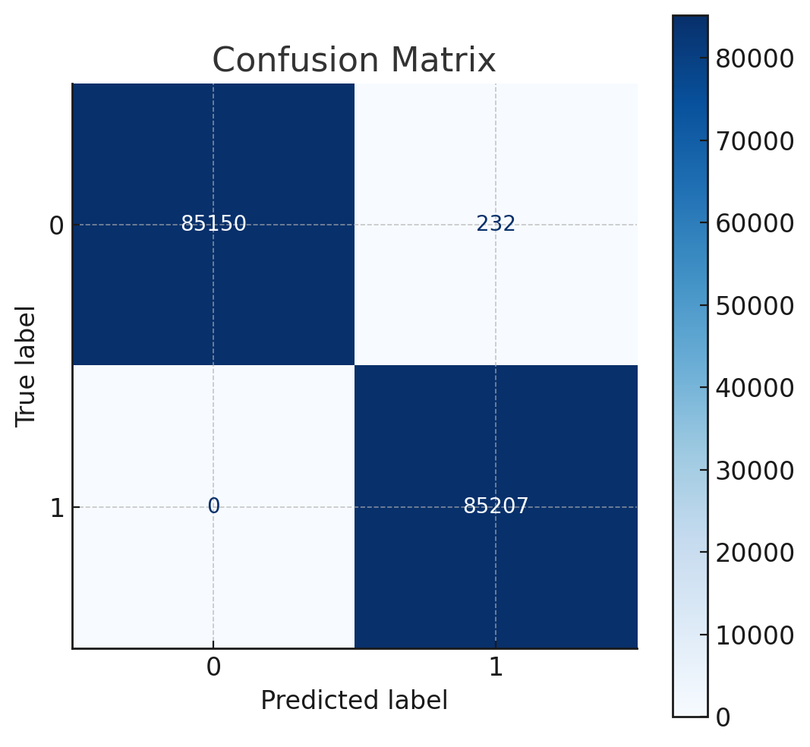
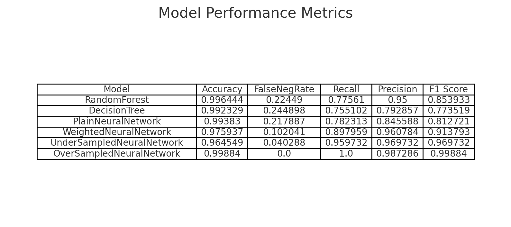

# Credit Card Fraud Detection Using Machine Learning

**Abstract**
Credit card fraud continues to be a major global issue, causing billions of dollars in losses annually. Machine learning provides an effective solution for detecting fraudulent transactions by identifying patterns indicative of fraud. Credit card fraud typically involves either the physical theft of a credit card or the compromise of sensitive credit card information. This project aims to develop a machine learning model to detect fraudulent transactions, leveraging historical transaction data. The model will be trained and evaluated using a dataset of past credit card transactions to ensure its effectiveness in identifying fraudulent activities.

Keywords: Fraud Detection, Credit Card Fraud, Fraudulent Transactions, K-Nearest Neighbors, Support Vector Machines, Logistic Regression, Decision Tree.

**Overview**

As credit card usage continues to rise globally, ensuring the security and safety of customers has become increasingly important. According to statistics, there were 2.8 billion credit card users worldwide in 2019, and reports of credit card fraud have grown alarmingly. In the United States alone, credit card fraud increased by 44.7% in 2020. Fraud can occur in two major forms:

1. Identity Theft: Opening a fraudulent account using someone else’s identity. This type of fraud rose by 48% in 2020.
2. Account Takeover: Using an existing credit card account by stealing sensitive information. Reports of this fraud increased by 9% in the same year.

These statistics highlight the pressing need for advanced solutions to tackle fraud. This project addresses this issue by using machine learning to analyze patterns and identify fraudulent transactions within a dataset, thereby providing a robust analytical approach to combating credit card fraud.

**Project Objectives**

The primary goal of this project is to accurately detect fraudulent credit card transactions. This is critical to protect customers from unauthorized charges for purchases they did not make. The project will:

* Employ multiple machine learning techniques to detect fraudulent transactions.
* Compare the performance of different models to identify the most effective one.
* Visualize results and provide insights using graphs and numerical analyses.
* Review previous research and methodologies for detecting fraud in transactional datasets.

**The project compares the results of different techniques :**

* Machine learning techniques:
* Random Forest
* Decision Trees
* Deep Learning techniques:
* Neural network using fully connected layers.

Performance of the neural network is compared for different optimization approaches:

* plain binary cross-entropy loss minimization
* minimization using weights to compensate for the class imbalance
* Under-sampling of the non-fraudulent class to match the fraudulent class
* Over-sampling of the fraudulent class to match the non-fraudulent one by implementing SMOTE technique. The SMOTE method allows to generate a new vector using 2 existing datapoints.

**Dataset Information**
The dataset for this project was obtained from Kaggle, an open-source platform, and includes transaction data from European credit card users over a two-day period in 2013. Key features of the dataset:

* Size: 284,808 rows and 31 attributes.
* Attributes:
  * 28 features have been transformed using PCA (Principal Component Analysis) to protect user confidentiality.
  * The remaining three attributes are:
    * Time: Elapsed seconds between the first and other transactions.
    * Amount: Transaction amount.
    * Class: Binary variable indicating fraud (1 for fraudulent, 0 for non-fraudulent).

This dataset provides a comprehensive basis for developing and evaluating machine learning models for fraud detection.

**Project Goals and Approach**

**1. Detection of Fraudulent Transactions**: The primary objective is to detect fraudulent credit card transactions, helping prevent financial loss for customers.

**2. Comparison of Machine Learning Techniques**: Multiple machine learning models, including K-Nearest Neighbors, Support Vector Machines, Logistic Regression, and Decision Trees, will be implemented and compared based on their performance.

**3. Evaluation and Visualization**: Results will be evaluated using metrics such as accuracy, precision, recall, and F1-score. Visualizations such as confusion matrices and performance graphs will provide insights into model effectiveness.

**4. Application of Analytical Techniques**: The project explores state-of-the-art methods and techniques for distinguishing fraudulent transactions from legitimate ones within a dataset.

This project aims to provide a reliable and scalable solution for detecting fraudulent credit card transactions using machine learning, paving the way for enhanced financial security and customer protection.

**Key Findings: Fraud Detection with SMOTE and Neural Networks**

By applying **SMOTE (Synthetic Minority Oversampling Technique)** to balance the dataset and using a simple neural network, we achieved the best results in detecting fraudulent credit card transactions:

* **100% of fraudulent transactions** were correctly identified in the test set.
* The method is **simple to implement**, **easy to use**, and can be **updated in real-time**.
* **False positives** remained at an acceptable level, reducing unnecessary workload for the fraud department compared to other methods.

**Key Result:**

Confusion Matrix using SMOTE and a simple neural network:

Comparison of key performance indicators between the tested approaches:

